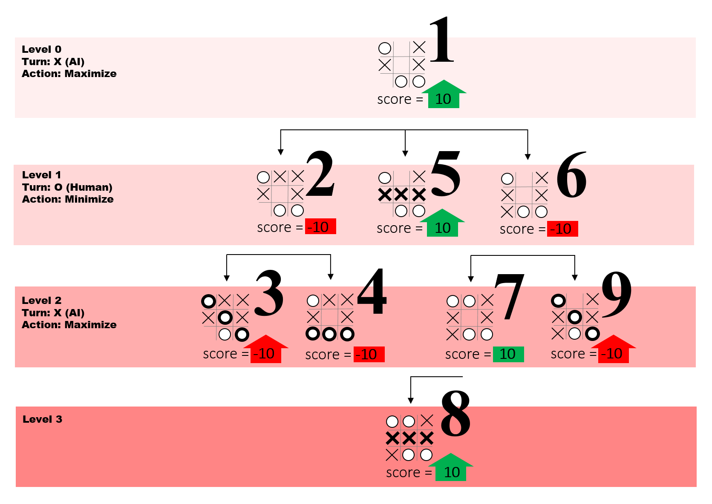

# Tic-Tac-Toe

## What is Minimax?

- Minimax is a recursive backtracking algorithm that explores all possible game states to find the optimal move.

- Minimax is a decision-making algorithm used in two-player games (like Tic-Tac-Toe, Chess, Checkers) where:

- One player tries to maximize their score (the "maximizer")

- The other tries to minimize the score (the "minimizer")
### Components:

- Game State: A node in the game tree

- Terminal State: Game over (win/lose/tie)

- Utility Function: Scores terminal states

- Minimax Value: The best achievable outcome against optimal play

```bash
Current Board
    /     |     \
Move1   Move2   Move3   (AI's possible moves)
  |       |       |
Opp1    Opp2    Opp3    (Opponent's responses)
  |       |       |
You1    You2    You3    (Your next responses)
...     ...     ...     (until game ends)
```

In Tic-Tac-Toe, we typically use:

- `+10` if AI wins

- `-10` if human wins

- `0` for a tie

Intermediate values for non-terminal positions.

### Base Cases:

```js
if (AI wins) return +10
if (Human wins) return -10  
if (tie) return 0
```
### Recursive Case:

```js
function minimax(newBoard, player) {
    // Available spots
    var availSpots = emptySquares(newBoard);

    // Check for terminal states
    if (checkWin(newBoard, huPlayer)) {
        return {score: -10};
    } else if (checkWin(newBoard, aiPlayer)) {
        return {score: 10};
    } else if (availSpots.length === 0) {
        return {score: 0};
    }

    // Array to collect all moves
    var moves = [];

    // Loop through available spots
    for (var i = 0; i < availSpots.length; i++) {
        // Create an object for each move
        var move = {};
        move.index = availSpots[i];
        
        // Set the empty spot to the current player
        newBoard[availSpots[i]] = player;

        // Recursively get the score from the resulting board
        if (player == aiPlayer) {
            var result = minimax(newBoard, huPlayer);
            move.score = result.score;
        } else {
            var result = minimax(newBoard, aiPlayer);
            move.score = result.score;
        }

        // Reset the spot to empty
        newBoard[availSpots[i]] = move.index;

        // Push the move to moves array
        moves.push(move);
    }

    // Choose the best move
    var bestMove;
    if (player === aiPlayer) {
        var bestScore = -10000;
        for (var i = 0; i < moves.length; i++) {
            if (moves[i].score > bestScore) {
                bestScore = moves[i].score;
                bestMove = i;
            }
        }
    } else {
        var bestScore = 10000;
        for (var i = 0; i < moves.length; i++) {
            if (moves[i].score < bestScore) {
                bestScore = moves[i].score;
                bestMove = i;
            }
        }
    }

    // Return the best move
    return moves[bestMove];
}
```



To optimize it you can also add code to prune branches of unecessary ones.

---


